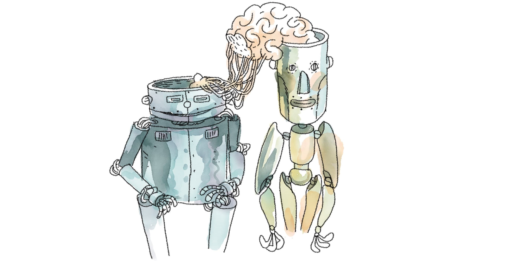

# An Introduction To Machine Learning

Welcome to this practical introduction to machine learning! 

The goal of these lectures is to get you started with machine learning fast and easy, so that you can then feel comfortable using it at work (or just for fun).

If you want to try machine learning for the first time, you're at the right place. The only prerequisite is a vague knowledge of any programming language. Here, we're going to use python, which is ruling the field at the moment.

We're not going to bother much about theory, mathematics, statistics. Instead, we'll focus on practical exercises. You'll get your feets wet for the tools commonly used in research and the industry, and you'll build a real feeling for machine learning.  

## Outline

The lectures are organized as a series of modules: 

1- Python basics for machine learning

* python crash course 
* introduction to numpy
* first plots with matplotlib 
   
2- Supervised learning

* ... TODO ... 

3- Unsupervised learning

* visualizing datasets and dimensionality reduction 
* clustering 

4- Introduction to deep learning
   
* get started with Keras and Tensorflow
* convolutional neural networks 
* embedding
* transfer learning

5- Long short term memories
   
* ... TODO ... 

6- Object detection in images with YOLOv3
   
* ... TODO ...

   
Each module features a set of slides presenting the main concepts, and jupyter notebooks with practical exercises. 

## How to follow this course? 

The course can be taken on several platforms. 

Please follow the instructions below to get started with the platform of your choice. 

### FloydHub

---

**Reserved to participants of the machine learning training at Université de Lyon, April 2020**

--- 

[FloydHub](https://www.floydhub.com) is a platform as a service that provides a zero-setup infrastructure for data science and deep learning. 

FloydHub makes it possible for you to reserve CPU and GPU instances to run your code, and provides a web IDE based on Jupyter Lab for the development and study of your machine learning models. 

For this course, you will use the resources of the ge-insa-lyon floydhub team, so you won't have to pay for your ressources :-) 

So first, you need to subscribe to floydhub and the ge-insa-lyon team:  

* subscribe to [FloydHub](https://www.floydhub.com). Note that **you do not have to provide payment information as requested**. If you do, you'll get free credits for your own account as a welcome gift. If you don't, you'll still be able to use the ressources of ge-insa-lyon. 
* send your floydhub username to thomas.grenier AT insa-lyon.fr, and ask him to add you to the team ge-insa-lyon, as a participant to the training. 

After getting confirmation that you're in the team:

[START!](https://www.floydhub.com/ge-insa-lyon/workspaces/run_8NNKTRZg4KcRtMeCU4dFzJ76)

### Google Colab

[Google Colab](https://colab.research.google.com/notebooks/intro.ipynb) is another platform as a service for data science and deep learning. 

The basic plan is completely free, but your processes will get killed if they take too long. Also, processing large datasets on Google Colab is not practical.

[START!](https://colab.research.google.com/github/cbernet/introduction_machine_learning/blob/master/get_started_workspace.ipynb)

### Your own machine

If you want to run on your own machine, you will need to install all the necessary software by yourself, which is actually an easy task with Anaconda. 

please follow [these instructions](doc/install_python_anaconda.md). 
